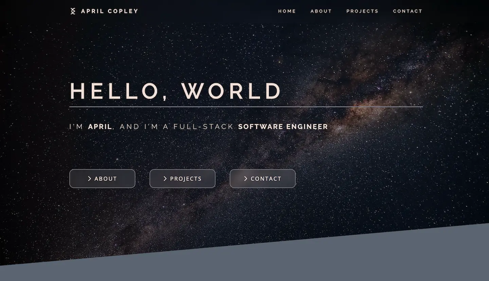

# April Copley | Software Engineer

Welcome to my portfolio website where you can learn a little bit about me and the cool stuff I've been building. You will also find a contact form and my social media info where you can follow me or maybe even offer me a position on your team.

**[Visit live site](https://aprilcopley.netlify.app)**

## How It's Made

**Tech used:**
-  Astro
-  HTML
-  CSS
-  JavaScript

This is my first project using the Astro framework. With Astro components and layouts, I created a responsive, accessible site with basic HTML, CSS, and a sprinkling of JavaScript.

## Optimizations

I would like to further explore the Astro component concept in order to create more modular, reusable code. I would also like to expand the site by adding a blog feature and implementing page routes.

## Lessons Learned

While Astro components and React components share similarities, they also have their differences. My favorite feature of Astro is the ability to use scoped styling, keeping my CSS rulesets with the HTML to which they will be applied.

## Other Projects

**[Digital Canvas](https://acopperlily.github.io/digital-canvas)**

**[Happy Hour Cocktails](https://acopperlily.github.io/happy-hour-cocktails)**

**[Catalyzer](https://catalyzer.netlify.app/)**
